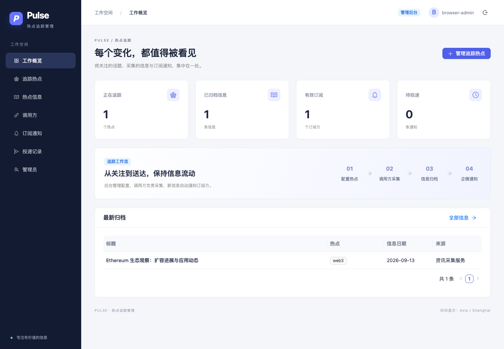

# Pulse · 热点追踪管理后台

中文管理后台：配置热点与采集备注、为调用方分配 API key、归档和搜索热点信息、通过企业微信群机器人发送可点击的图文卡片订阅通知。采集、定时调度和 AI 总结由外部调用方完成。

## 本地启动

需要 Node.js 22+、MariaDB 10.11+。使用 nvm 时先运行 `nvm use`（项目提供 `.nvmrc`）。使用独立的 `utf8mb4` 数据库及项目数据库账号。

```bash
npm ci
cp .env.example .env
# 编辑 .env 的数据库配置，并生成 ENCRYPTION_KEY：
node -e "console.log(require('crypto').randomBytes(32).toString('base64'))"
npm run db:migrate
# 把初始密码写到仅自己可读的临时文件，不要放进命令行或聊天。
ADMIN_PASSWORD_FILE=/absolute/path/to/protected-password.txt npm run admin:create -- admin
npm run dev
```

打开 http://127.0.0.1:5173，使用刚创建的管理员登录。初始化完成后删除临时密码文件。没有默认账号或密码。不要把 `.env` 提交到 Git。

`ENCRYPTION_KEY` 必须是 32 字节的 Base64 密钥。生产启用 `COOKIE_SECURE=true`，必须使用 HTTPS；本机开发可设为 `false`。保持密钥稳定，丢失后无法解密已有机器人 key。日期字段是日历日期；创建、入库和投递时间以 UTC 存储、上海时区展示。

## 功能与界面

- 工作概览：热点、信息、订阅、待投递数量和最新归档。
- 追踪热点：名称、采集备注、启用与停用、关键词搜索。
- 热点信息：按热点与日期筛选、搜索标题/总结/正文、查看详情及原文，展示 AI 热度评分。
- 调用方：生成、重置和禁用 key，查看最后调用时间；支持每批最多 10 条信息及前三名热度通知。
- 订阅方：选择热点或订阅全部，key 加密保存，发送测试通知；热点通知使用可点击的图文卡片。
- 投递记录：查看状态及每次尝试，手动重试失败任务。
- 管理员：创建、禁用和密码重置。管理员共享数据，最后一个有效管理员不能禁用。

管理后台不提供公开注册或热点采集。调用方不能创建热点或读取管理接口。

## API

登录后访问 `/api/docs/` 查看 OpenAPI。子路径部署时在接口前添加 `APP_BASE_PATH`。调用方 AI 的采集、整理、重试和幂等处理指南见 [docs/caller-ai-guide.md](docs/caller-ai-guide.md)；简版接口契约和 curl 示例见 [docs/API.md](docs/API.md)；ChatGPT / MCP 接入见 [docs/CHATGPT_MCP.md](docs/CHATGPT_MCP.md)。

## 验证

```bash
npm run build
npm test
# 仅对隔离测试库运行！测试会清空该库，数据库名必须以 _test 结尾。
DB_NAME=fetch_news_test npm run test:integration
DB_NAME=fetch_news_test npm run test:runtime
# 浏览器验收同样清空测试库，先构建；macOS 默认使用本机 Chrome。
# Linux 先执行 npx playwright install --with-deps chromium，或设置 CHROME_PATH。
DB_NAME=fetch_news_test npm run test:browser
```

集成测试必须连接真实 MariaDB，覆盖并发去重、事务回滚、权限、通知匹配、重试和租约恢复。测试注入模拟 sender，不向企业微信发送消息。`.github/workflows/ci.yml` 在 MariaDB 10.11 上执行相同构建和测试。

## 生产运行与部署

```bash
npm run build
NODE_ENV=production npm start
```

应用启动前必须执行迁移。生产包使用 `dist/`、`migrations/`、生产 `node_modules/` 和 package 文件。Nginx 提供静态资源，Node.js 仅监听回环地址，由 systemd 管理。通知队列使用共享 MariaDB，无需 Redis。

已部署至 [热点追踪后台](https://8.130.116.192/davyluiy/fetch-news/)，源码位于 [wahbm/fetch-news](https://github.com/wahbm/fetch-news)。推送 main 自动执行测试与 ECS 发布，支持手动触发。详见 [部署与交接](docs/DEPLOYMENT.md) 和 [通知与运维](docs/OPERATIONS.md)。

本次验证环境、结果及未验证事项见 [验证记录](docs/VERIFICATION.md)。下次 AI 接手开发前请先阅读 [项目上下文](docs/PROJECT_CONTEXT.md)、[架构说明](docs/ARCHITECTURE.md) 和 [待办](docs/TODO.md)。

## 界面预览

浏览器验收生成的示例数据截图：


